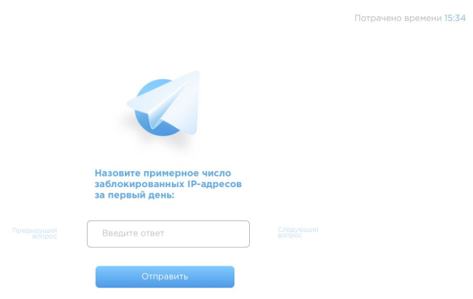

Результат:  
https://calm-reef-49778.herokuapp.com/ (подождите 20-40 сек, пока стартует dyno)

***

## Тестовое задание на позицию frontend разработчика

Разработать single page application, которое позволяет измерять скорость прохождения
опросника.

Пользователь открывает страницу и видит перед собой кнопку начать.
После начала переходит к списку вопросов. Вопрос представляет из себя ссылку на
картинку. Для простоты будем считать, что текст вопроса написан на картинке.

- Пользователь может переходить по вопросам влево-вправо.
- Пользователь может ввести ответ в поле и отправить. После отправки вопрос
пропадает и открывается следующий. Отвеченный вопрос больше не
отображается.
- Если пользователь перезагрузит страницу, он вернется туда же, где был. При этом
все данные должны сохраниться (время и ответы). Отвеченные вопросы по
прежнему должны быть скрыты.
- После ответа на все вопросы отображаем какие ответы были даны на каждый,
сколько времени занял каждый вопрос и общее время прохождения опроса.

Справа вверху находится таймер. Таймер привязан к каждому вопросу в отдельности.

Если человек приходит на новый вопрос, то таймер идет с нуля на увеличение. Если возвращается на вопрос, на котором уже был, то таймер идет с того момента, на котором
остановился, когда ушел с вопроса.

В работе с апи вам поможет файл api.js, который вы включаете в свой проект.
На выходе хотим получить репозиторий с проектом и сбилденный проект. Верстка не
принципиальна, просто как референс.
